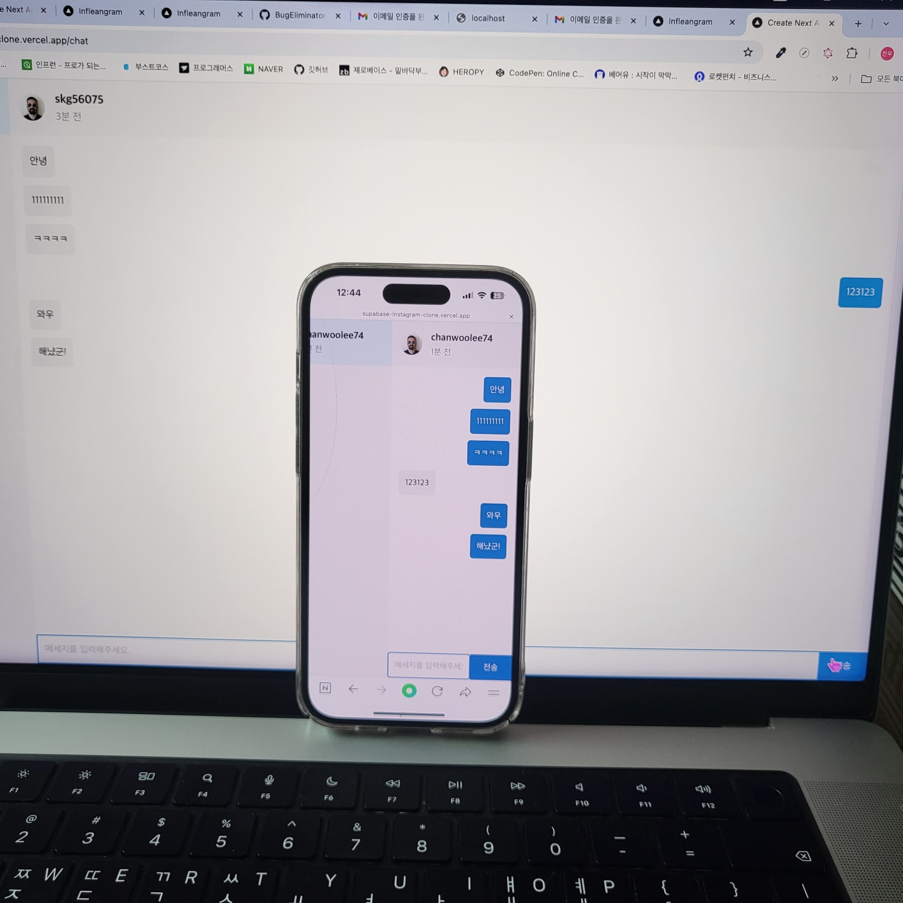

# 📸 Supabase Instagram Clone

**Supabase, Recoil, Next.js, TailwindCSS**를 활용하여  
**인증 / 실시간 채팅 기능**이 포함된 SNS 웹 애플리케이션입니다.

---

## 🔗 배포 주소

👉 [https://supabase-instagram-clone.vercel.app](https://supabase-instagram-clone.vercel.app)

---

## 🔧 사용 기술

- **Next.js 14** – React 기반 프레임워크
- **Supabase** – 인증, 실시간 DB, 스토리지 등 백엔드 서비스
- **Recoil** – 전역 상태 관리 라이브러리
- **TailwindCSS** – 유틸리티 기반 CSS 프레임워크
- **React Query** – 비동기 상태 관리 및 캐싱
- **Vercel** – 정적 사이트 호스팅 플랫폼

---

## 💡 주요 기능

### ✅ 회원가입 & 로그인 (Supabase Auth)

- 이메일 인증 링크 방식
- `NEXT_PUBLIC_REDIRECT_URL` 환경변수를 통해 로컬/배포 환경 구분
- 인증 링크 클릭 시 `/signup/confirm` 페이지로 이동하여 인증 처리

---

### 💬 채팅 기능

- Supabase 테이블 구조
  - `message`: `id`, `message`, `sender`, `receiver`, `is_deleted`, `created_at`
- **Postgres Changes** 실시간 채널 구독
- **React Query**로 메시지 패칭 및 전송
- **Recoil**로 현재 선택된 채팅 대상 전역 관리

---

### 🎨 UI 구성

- TailwindCSS를 활용한 반응형 UI 설계
- 배경 그라디언트 예시:
  ```css
  bg-gradient-to-r from-green-400 via-pink-500 to-blue-500
  ```

## 📸 시연 사진

<p>  </p>
